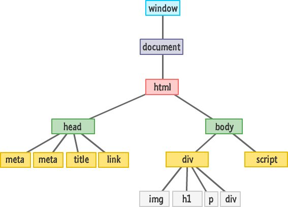

# DOM manipulation

> DOM manipulation - sculpting web pages with JavaScript.

Document Object Model (DOM) refers to the representation of HTML elements of a web page as objects in a manner where you can easily interact and manipulate them dynamically using JavaScript. Through the DOM, you can use JavaScript to change the structure, content, or style of a web page on the fly.

<div style="text-align: center"></div>

**Figure** - Document Object Model By Dominic V. Smith.

With DOM manipulation, you can select and manipulate any element on the website using various methods. The following methods can be used to select elements on a webpage:

1. **`getElementById():`** This allows you to select an element by its unique `id` attribute.

   ```javascript
   var element = document.getElementById("myElementId");
   ```

2. **`getElementsByClassName():`** This selects elements by their class name.

   ```javascript
   var elements = document.getElementsByClassName("myClassName");
   ```

3. **`getElementsByTagName():`** You can select elements by their tag name.

   ```javascript
   var elements = document.getElementsByTagName("div");
   ```

4. **`querySelector():`** Select the first element that matches a CSS selector.

   ```javascript
   var element = document.querySelector("#myElementId");
   ```

5. **`querySelectorAll():`** Select all elements that match a CSS selector.

   ```javascript
   var elements = document.querySelectorAll(".myClassName");
   ```

After selecting any element, you would want to modify it. The following includes various ways you can modify elements using JavaScript:

1. **Changing text content:**

   ```javascript
   element.textContent = "New Text";
   ```

2. **Changing HTML content:**

   ```javascript
   element.innerHTML = "<p>New HTML content</p>";
   ```

3. **Changing attributes:**

   ```javascript
   element.setAttribute("src", "new-image.jpg");
   ```

4. **Adding and removing classes:**

   ```javascript
   element.classList.add("newClass");
   element.classList.remove("oldClass");
   ```

Aside from modification, you can also add or append elements. To create and append elements, do the following:

1. **`createElement():`** Create a new HTML element.

   ```javascript
   var newElement = document.createElement("div");
   ```

2. **`appendChild():`** Add an element as a child of another element.

   ```javascript
   parentElement.appendChild(newElement);
   ```

You can also remove elements from a webpage using the following lines of code:

1. **`removeChild():`** Remove a child element from its parent.

   ```javascript
   parentElement.removeChild(childElement);
   ```

On Chrome, you can see the DOM structure of any website by inspecting it. You can do so on windows using `ctrl` + `shift` + `i` or `Cmd` + `Option` + `I` on Mac.

!> For a more streamlined interface for inspecting and understanding the structure of a web page, you can use the [DOM tree viewer Chrome extension](https://chrome.google.com/webstore/detail/dom-node-tree-viewer/jbplakkefflidgnjhckoahendgekokfc).

DOM manipulation in JavaScript allows you to interact with and change the content and structure of a web page. You can select elements, modify their properties and attributes, create new elements, attach event listeners for interactivity, and remove elements as needed. This capability is essential for building dynamic and interactive web applications.

## Further study

Here are some links for further study on the concept of DOM manipulation in JavaScript:

- [Document Object Model (DOM)](https://developer.mozilla.org/en-US/docs/Web/API/Document_Object_Model/Introduction).
- [DOM manipulation](https://developer.mozilla.org/en-US/docs/Learn/JavaScript/Client-side_web_APIs/Manipulating_documents).
